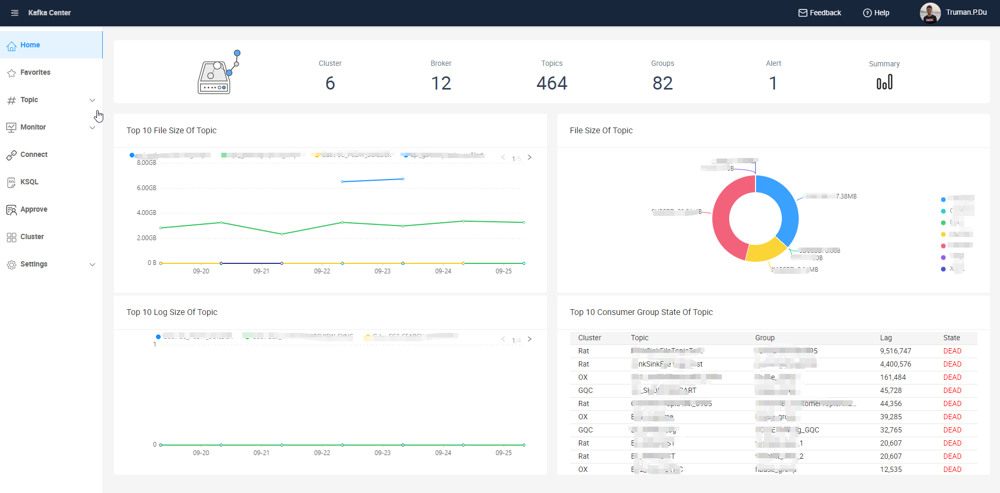

Language: :us: - :[cn](./README_zh.md):
# KafkaCenter


KafkaCenter is a unified one-stop platform for Kafka cluster management and maintenance, producer/consumer monitoring, and use of ecological components.

**Table of Contents**
  - [Why Should I Use KafkaCenter?](#why-should-i-use-kafkacenter)
  - [Main Features](#main-features)
  - [Application Config](#application-config)
  - [Getting Started](#getting-started)
    - [1. Init](#1-init)
    - [2. Run](#2-run)
    - [3. Access UI](#3-access-ui)
  - [Building KafkaCenter and/or Contributing Code](#building-kafkacenter-andor-contributing-code)
  - [Documentation](#documentation)
  - [Changelog](#changelog)
  - [Questions? Problems? Suggestions?](#questions-problems-suggestions)


## Why Should I Use KafkaCenter?

You have a Kafka cluster* and want to
- monitor producers and consumers with graphs and the ability to easily configure email alerts for thresholds
- let your users request topics and monitor them themselves in a simple web UI
- access the Kafka ecosystem (Kafka, KSQL, Kafka Connect, Kafka Manager) in one combined UI

All you need is a MySQL DB in the background where KafkaCenter can store its configuration. If you want to use the monitoring functionalities, you additionally need an Elasticsearch installation.
Then, just download our Docker image (see HowTo below) and off you go!

*\* Note: KafkaCenter does not yet support authenticating to a secured Kafka cluster (SASL or OAuth), we're working on it though.*


## Main Features



- **Home** -> Overview of all configured Kafka clusters as well as high-level monitoring information.
- **Favorites** -> Direct access to the monitoring statistics of your favorite topics.
- **Topic** -> View your own topics or *apply for new topics. You can also both consume messages and mock new records via web UI into your topics here!*
- **Monitor** -> Statistics about production and consumption of your topics. *There is an additional possibility to configure alerts (which optionally trigger emails) for arbitrary consumption delay thresholds here!*
- **Kafka Connect** -> Create and maintain your own Kafka Connect jobs (needs an external Kafka Connect service to connect to).
- **KSQL** -> Create and maintain your own KSQL jobs (needs an external KQL service to connect to).
- **Approve** -> Users can view their topic creation requests here, administrators can manage and approve the requests.
- **Settings** -> Maintain users and teams (accessible by administrators only). *You can also use an external OAuth solution for the user management.*
- **Kafka Manager** -> Maintain Kafka cluster information (embedded UI from the popular open-source tool [Kafka Manager](https://github.com/yahoo/CMAK)).


## Application Config
The main application configuration is done in a central `application.properties` file. Have look at our [detailed example here](KafkaCenter-Core/src/main/resources/application.properties).


## Getting Started

**Important**: The application **needs a MySQL database** to store all configurations. Before you begin, make sure that you have it either installed on the same host or that there's an instance available somewhere else. The exact location can then be configured via the `spring.datasource.url` inside the `application.properties`. (There is *no* MySQL service included in the Docker image.)

Resource|Dependencies|Use
---|---|---
MySQL|must|Stores all configuration information (users, teams, clusters, etc.)
Elasticsearch (7.0+)|optional|Stores monitoring information (cluster metrics, consumption lag visualization, etc.)
Email server|optional|Email notifications (topic requests & approvals, configured consumer alerts)

### 1. Init

#### Create database and table
Execute the provided [table_script.sql](KafkaCenter-Core/sql/table_script.sql) on your MySQL instance to create the database and all necessary tables.

#### Edit config
Download the provided [application.properties](KafkaCenter-Core/src/main/resources/application.properties) example and adapt the config to your needs.


### 2. Run

#### Option A (**recommended**): Docker

The following command assumes that you have your adapted `application.properties` inside the same folder:
```
docker run -d \
  -p 8080:8080 \
  --name KafkaCenter \
  -v ${PWD}/application.properties:/opt/app/kafka-center/config/application.properties \ 
  xaecbd/kafka-center:2.1.0
```

#### Option B: Local

**Important**: Make sure you have installed a **JRE 8** or higher and download the most recent [release package](https://github.com/xaecbd/KafkaCenter/releases).
```
$ git clone https://github.com/xaecbd/KafkaCenter.git
$ cd KafkaCenter
$ mvn clean package -Dmaven.test.skip=true
$ cd KafkaCenter\KafkaCenter-Core\target
$ java -jar KafkaCenter-Core-2.1.0-SNAPSHOT.jar
```


### 3. Access UI
The application UI is published on port *8080*. Visit `http://localhost:8080` (or insert the IP/URL of the host you deployed on) and log in with the default administrator：**user/pw = admin/admin**


## Building KafkaCenter and/or Contributing Code

We're happy if you want to play around and build KafkaCenter locally, or even get involved in shaping and developing KafkaCenter further. The [Contributing Guidelines](./CONTRIBUTING.md) will help to get you started.


## Documentation

For more information, see the README in [KafkaCenter/docs](./docs).<br/>
For information about user guide the documentation, see the UserGuide in [KafkaCenter/docs/UserGuide](./docs/UserGuide.md)  
For information about module the documentation, see the Module in [KafkaCenter/docs/Module](./docs/Module.md).<br/>
For information about kafka connect ui, see docs in [KafkaConnectUi](./docs/KafkaConnectUi.md).

*Note that we open-sourced our tool very recently and did not translate all the documents to English yet. (We are happy about contributions in this area as well if you're motivated!)*


## Changelog

See the separate [Changelog](./CHANGELOG.md).


## Questions? Problems? Suggestions?

If you found a bug, want to request a feature or have a question, please create an [issue](https://github.com/xaecbd/KafkaCenter/issues/new). Try to make sure someone else hasn't already created an issue for the same topic beforehand.
